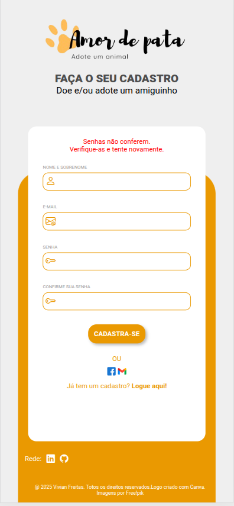

##  🌟 Projeto: Amor de Pata

Amor de Pata é um projeto full stack cujo objetivo é conectar pessoas interessadas em adotar animais e permitir a realização de doações.

Como estudante de Sistemas de Informação, eu tenho como objetivo fazer não apenas uma API simples, mas tentar deixa-la o mais estrutural possível e de forma profissional. 
Muitas funcionalidades vistas aqui foram colocadas e estudadas aos poucos para que eu consiga sair da minha zona de conforto que era o CRUD.

### Tecnologias utilizadas (Back-end):
1. [x] Java 21.
2. [x] Springboot 3.
3. [x] SpringSecurity.
4. [x] MySQL.
5. [x] JavaScript.
6. [x] Docker.
7. [x] ENUM.
8. [x] DTOs.
9. [x] Logs.
10. [x] Testes.
11. [x] GlobalExceptions.
12. [X] Bean Validations.
13. [X] Cloudinary (Plataforma na Nuvém para hospedar imagens).
14. [x] Swagger.
15. [x] JPQL no JpaRepository.
16. [x] Relacionamento de entidades.

### Tecnologias utilizadas (Front-end):
1. [x] JavaScript.
2. [x] Fetch API.
3. [x] CSS.
4. [x] HTML.

### 📌 Funcionalidades

* Cadastro e autenticação de usuários
* Login  com Spring Security
* Visualização de animais disponíveis para adoção
* Cadastro de animais para adoção
* Realização de doações

**O projeto segue uma arquitetura cliente-servidor:**
1. [x] **Front-end:** Interface para o usuário
2. [x] **Back-end:** API REST responsável pelas regras de negócio, autenticação e persistência de dados
****


### Page cadastro e método POST

**Front-end**:
A página de cadastro permite que o usuário informe seus dados pessoais para criar uma conta e, posteriormente, acessar a tela de login. Caso já tenha o cadastro, ela permite que o usuário vá diretamente para a tela de login.

**Fluxo:**

* Usuário preenche o formulário de cadastro 
* Os dados são enviados via método POST para a API 
* O back-end valida e persiste os dados no banco de dados 
* O usuário passa a ter acesso ao sistema
### Layout


**Endpoint de Cadastro:** `/api/createUser`

**JSON**:
```json
{
"nameUser": "Roberto",
"emailUser": "Roberto123@gmail.com",
"passwordUser": "123456"
}
```

As senhas são salvas em **hash** para proteção do usuário. Exemplo de retorno ao usuário ser salvo:

```json
{
"idUser": 4,
"nameUser": "Roberto",
"emailUser": "roberto@gmail.com",
"passwordUser": "$2a$10$7Rc/hKWUARPp6B/k.rvso.tiuLa4XHT4/DKVgrM3w2CtVZQhS25x2",
"listAnimal": null,
"username": "roberto@gmail.com",
"authorities": [],
"password": "$2a$10$7Rc/hKWUARPp6B/k.rvso.tiuLa4XHT4/DKVgrM3w2CtVZQhS25x2",
"enabled": true,
"accountNonExpired": true,
"accountNonLocked": true,
"credentialsNonExpired": true
```